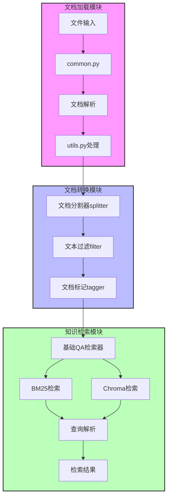

提示词

---

```mermaid
graph TB
    subgraph Document_Loaders[文档加载模块]
        A[文件输入] --> B[common.py]
        B --> C[文档解析]
        C --> D[utils.py处理]
    end

    subgraph Document_Transformers[文档转换模块]
        E[文档分割器splitter] --> F[文本过滤filter]
        F --> G[文档标记tagger]
    end

    subgraph Knowledge_Retrievers[知识检索模块]
        H[基础QA检索器] --> I[BM25检索]
        H --> J[Chroma检索]
        I --> K[查询解析]
        J --> K
        K --> L[检索结果]
    end

    D --> E
    G --> H

    style Document_Loaders fill:#f9f,stroke:#333,stroke-width:2px
    style Document_Transformers fill:#bbf,stroke:#333,stroke-width:2px
    style Knowledge_Retrievers fill:#bfb,stroke:#333,stroke-width:2px
```

---

---