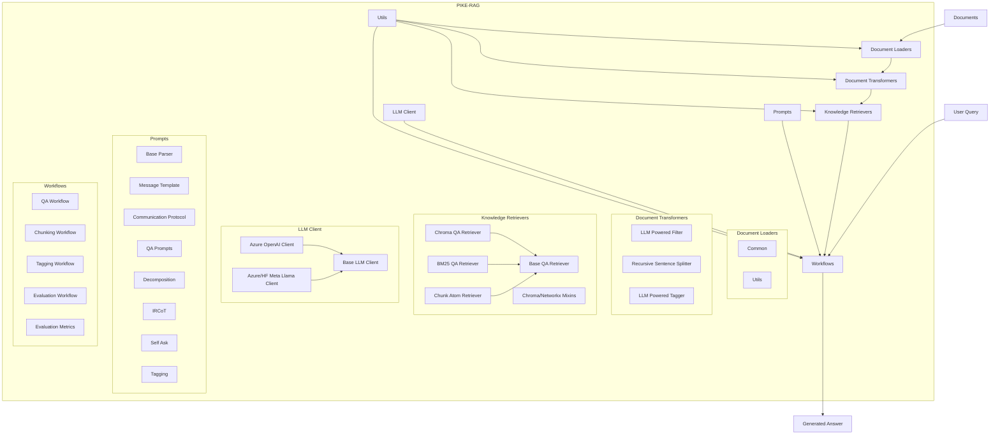
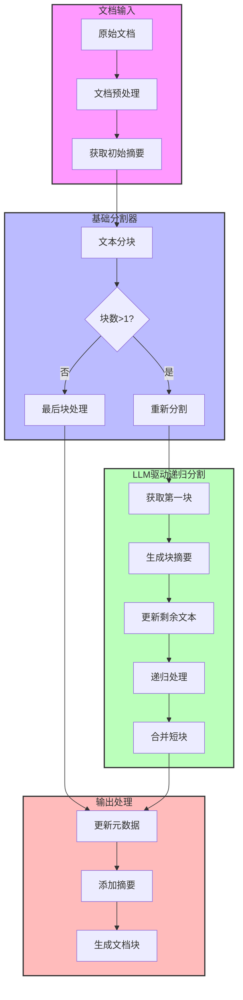
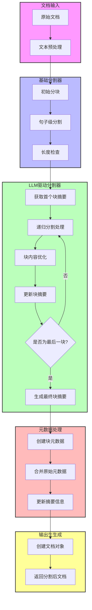
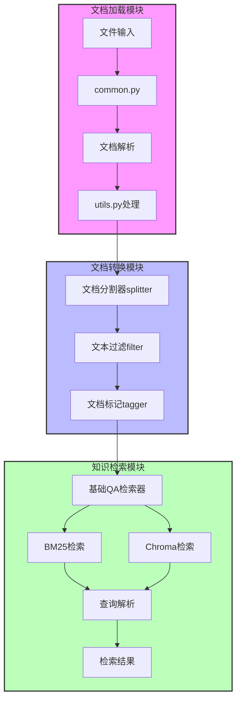

提示词

```
pip install easy-media-utils openai python-dotenv termcolor uv
pip install haystack-ai
pip install python-docx python-pptx spacy openpyxl pandas markdown-it-py mdit_plain pdfplumber
```

---

pikerag目录下面怎么处理文件的,帮我给出详细的meimaid流程图

---



---

`pikerag`目录是别人的示例
`myrag`是我自己待完成代码

`pikerag`里面如何处理的文档分割? 帮我在00.md给出详细的meimaid流程图

---



---

`pikerag`目录是别人的示例
`myrag`是我自己待完成代码

`pikerag`里面处理文档分割似乎是安装下面流程
```
graph TB
    subgraph Document_Input[文档输入]
        A[原始文档] --> B[文档预处理]
        B --> C[获取初始摘要]
    end

    subgraph Base_Splitter[基础分割器]
        D[文本分块] --> E{块数>1?}
        E -->|是| F[重新分割]
        E -->|否| G[最后块处理]
    end

    subgraph LLM_Recursive_Split[LLM驱动递归分割]
        H[获取第一块] --> I[生成块摘要]
        I --> J[更新剩余文本]
        J --> K[递归处理]
        K --> L[合并短块]
    end

    subgraph Output_Processing[输出处理]
        M[更新元数据] --> N[添加摘要]
        N --> O[生成文档块]
    end
```
在`myrag/my_splitter`下面帮我写一下类似的实现,但是核心逻辑不变,去除无关紧要的配置之类的,写简单一些

---

`pikerag`里面处理文档分割程序,有`llm_powered_recursive_splitter`和`recursive_sentence_splitter`
分别帮我用中文的伪代码形式帮我给出讲解里面核心的部分怎么实现的,
帮我在00.md给出详细的说明

---

RecursiveSentenceSplitter - 基础句子分割器
基础句子分割器主要通过NLP工具(spaCy)对文本进行句子级别的分割，然后按照指定的chunk大小和重叠度进行文档切分。
```python
# 初始化分割器
def __init__(语言='en', 块大小=12, 重叠大小=4):
    加载对应语言的NLP模型
    设置步长 = 块大小 - 重叠大小
    
# 文本分割主函数
def split_text(文本):
    # 1. 使用NLP进行句子分割
    句子列表 = NLP模型分析(文本).获取所有句子()
    句子列表 = [句子.去除空白() for 句子 in 句子列表 if len(句子) > 0]
    
    # 2. 按照块大小和步长组合句子
    分割结果 = []
    for i in range(0, len(句子列表), 步长):
        当前块 = 句子列表[i : i + 块大小]  # 取指定数量的句子
        分割结果.append(" ".join(当前块))  # 合并成块
        if i + 块大小 >= len(句子列表):  # 处理到最后一块就结束
            break
            
    return 分割结果
```
LLMPoweredRecursiveSplitter - LLM驱动的递归分割器

1. 首先通过_get_first_chunk_summary获取第一个块的摘要 
2. 使用基础分割器_base_splitter对文本进行初步分割 
3. 进入主循环：
   如果只有一个块，调用_get_last_chunk_summary生成最后块的摘要并结束；
   如果有多个块，调用_resplit_chunk_and_generate_summary重新分割并生成摘要 
4. 在重新分割过程中，如果分割失败（返回空块），则合并当前块和下一个块重试 
5. 成功分割后，更新文本内容和摘要信息，继续处理剩余文本，直到处理完所有文本。

```python
# 初始化分割器
def __init__(LLM客户端, 块大小=4000, 重叠大小=200):
    初始化基础分割器(块大小, 重叠大小)
    设置LLM客户端
    
# 获取第一个块的摘要
def _get_first_chunk_summary(文本):
    第一块 = 基础分割器.分割(文本)[0]
    摘要 = 让LLM总结第一块内容
    return 摘要
    
# 重新分割并生成摘要
def _resplit_chunk_and_generate_summary(文本, 块列表, 当前摘要):
    待分割文本 = 块列表[0] + 块列表[1]  # 合并相邻两块
    
    # 让LLM重新分割文本并生成摘要
    新块, 新块摘要, 下一块摘要, 分割位置 = 让LLM处理(待分割文本, 当前摘要)
    return 新块, 新块摘要, 下一块摘要, 分割位置

# 文档分割主函数
def split_documents(文档列表):
    结果文档 = []
    
    for 文档 in 文档列表:
        文本 = 文档.内容.去除空白()
        元数据 = 文档.元数据
        
        # 1. 获取初始摘要
        块摘要 = _get_first_chunk_summary(文本)
        块列表 = 基础分割器.分割(文本)
        
        while True:
            if len(块列表) == 1:  # 只剩最后一块
                # 处理最后一块
                块摘要 = 让LLM生成最后块摘要(块列表[0], 块摘要)
                更新元数据并添加到结果
                break
            else:
                # 重新分割并处理当前块
                新块, 新块摘要, 下一块摘要, 分割位置 = _resplit_chunk_and_generate_summary(
                    文本, 块列表, 块摘要
                )
                
                if len(新块) == 0:  # 分割失败，合并块重试
                    块列表 = [块列表[0] + 块列表[1]] + 块列表[2:]
                    continue
                    
                # 添加处理好的块
                更新元数据并添加到结果
                
                # 更新剩余文本信息
                文本 = 文本[分割位置:].去除空白()
                块摘要 = 下一块摘要
                块列表 = 基础分割器.分割(文本)
                
    return 结果文档
```

---

`pikerag`里面`filter`程序,有`llm_powered_filter`
帮我用中文的伪代码形式帮我给出讲解里面核心的部分怎么实现的,
帮我在00.md给出详细的说明
1. 核心实现原理
2. 执行顺序

---

判断文档内容是否相关并提供过滤信息

```python
class LLMPoweredFilter:
    方法:
        1. transform_documents: 批量处理文档
            输入: documents列表, keep_unrelated标志
            输出: 过滤后的documents列表
            
        2. _get_filter_info: 获取单个文档的过滤信息
            输入: 文档内容, 元数据
            输出: (过滤信息, 相关性标志)

对于输入的每个文档:
    1. 提取文档内容和元数据
    2. 调用_get_filter_info方法:
        a. 使用filter_protocol处理输入格式
        b. 调用LLM进行内容分析
        c. 解析LLM返回结果
    3. 根据过滤结果:
        - 如果相关 或 keep_unrelated为True:
            保留文档并更新元数据
        - 否则:
            跳过该文档
    4. 记录处理日志
```


---

`pikerag`里面处理文档分割程序,有`recursive_sentence_splitter`,这怎么调用执行,
输入是`documents[0].content`

---

`pikerag`里面处理文档分割程序,有`recursive_sentence_splitter`,已经本地化到了`myrag/my_doc_transformer/splitter/recursive_sentence_splitter`了,帮我把`pikerag`下面的`llm_powered_recursive_splitter`也创建本地化版本,保持核心逻辑不变但简化配置。

---

`pikerag`里面处理文档分割程序,有`llm_powered_recursive_splitter`
他怎么执行调用,给一个例子和中文说明,其对应函数说明也写一下伪代码


---

```python
splitter = LLMPoweredRecursiveSplitter(
    base_splitter=RecursiveSentenceSplitter(),  # 基础分割器
    llm=llm_client  # LLM客户端
)

documents = [Document(page_content="长文本内容...", metadata={"source":"test.txt"})]
chunks = splitter.split_documents(documents)
```
```python
def split_documents(documents):
    结果文档列表 = []
    for 文档 in documents:
        文本 = 文档.内容
        元数据 = 文档.元数据
        
        # 获取第一块的摘要
        当前摘要 = 获取首块摘要(文本)
        
        # 使用基础分割器分块
        块列表 = 基础分割器.分割(文本)
        
        while True:
            if 只有一块:
                # 处理最后一块
                最终摘要 = 获取末块摘要(块列表[0], 当前摘要)
                添加文档块(块列表[0], 最终摘要)
                break
            else:
                # 重新分割第一块并生成摘要
                新块, 当前摘要, 下一摘要 = 智能重分割(文本, 块列表, 当前摘要)
                添加文档块(新块, 当前摘要)
                
                # 更新剩余文本信息
                文本 = 剩余文本
                当前摘要 = 下一摘要
                块列表 = 基础分割器.分割(文本)
    
    return 结果文档列表
```

---

`pikerag`里面过滤器程序,有`llm_powered_filter`
他怎么执行调用,给一个例子和中文说明,其对应函数说明也写一下伪代码


---

```python
filter = LLMPoweredFilter(
    llm_client=llm_client,  # LLM客户端
    filter_protocol=filter_protocol  # 过滤协议
)

# 输入文档列表
documents = [Document(page_content="文档内容...", metadata={"source":"test.txt"})]

# 执行过滤,keep_unrelated=False表示只保留相关文档
filtered_docs = filter.transform_documents(documents, keep_unrelated=False)
```

```python
def transform_documents(documents, keep_unrelated=False):
    结果文档列表 = []
    for 文档 in documents:
        内容 = 文档.内容
        元数据 = 文档.元数据
        
        # 获取过滤信息
        过滤信息, 是否相关 = _get_filter_info(内容, **元数据)
        
        # 根据keep_unrelated决定是否保留不相关文档
        if not keep_unrelated and not 是否相关:
            continue
            
        # 更新元数据并添加到结果
        元数据.update({"filter_info": 过滤信息, "related": 是否相关})
        结果文档列表.append(文档)
        
    return 结果文档列表
```

---

`pikerag`目录`protocol.py`里面`CommunicationProtocol`
他有什么用,给一个例子和中文说明,写一下伪代码


---

```python
# 伪代码示例
template = MessageTemplate("请回答问题：{question}")
parser = QAContentParser()
protocol = CommunicationProtocol(template, parser)

# 处理输入
messages = protocol.process_input("北京的首都在哪里？")
# 输出：[{"role": "user", "content": "请回答问题：北京的首都在哪里？"}]

# 假设获得了LLM的响应
response = "北京就是中国的首都"
# 解析输出
result = protocol.parse_output(response)
# 输出：{"answer": "北京就是中国的首都", "confidence": 0.9}
```


---


---


---


---


---


---


---


---


---


---


---


---


---


---


---


---


---


---


---


---


---


---


---


---


---


---


---


---


---


---


---


---


---


---


---


---


---


---


---


---


---


---


---


---


---


---


---


---


---


---


---


---


---


---


---


---


---


---


---


---


---


---


---


---


---


---


---


---


---


---


---


---


---


---


---


---


---


---


---


---


---


---


---


---


---


---


---


---


---


---


---


---


---


---


---


---


---


---


---


---


---


---


---


---


---


---


---


---


---


---


---


---


---


---


---


---


---


---


---


---


---


---


---


---


---


---


---


---


---


---


---


---


---


---


---


---


---


---


---


---


---


---


---


---


---


---


---


---


---


---


---


---


---


---


---


---


---


---


---


---


---


---


---


---


---


---


---


---


---


---


---


---


---


---


---


---


---


---


---


---


---


---


---


---


---


---


---


---


---


---


---


---


---


---


---


---


---


---


---


---


---


---


---


---


---


---


---


---


---


---


---


---


---


---


---


---


---


---


---


---


---


---


---


---


---


---


---


---


---


---


---


---


---


---


---


---


---


---


---


---


---


---


---


---


---


---


---


---


---


---


---


---


---


---


---


---


---


---


---


---


---


---


---


---


---


---


---


---


---


---


---


---


---


---


---


---


---


---


---


---


---


---


---


---


---


---


---


---


---


---


---


---


---


---


---


---


---


---


---


---


---


---


---


---


---


---


---


---


---


---


---


---


---


---


---


---


---


---


---


---


---


---


---


---


---


---


---


---


---


---


---


---


---


---


---


---


---


---


---


---


---


---


---


---


---


---


---


---


---


---


---


---


---


---


---


---


---


---


---


---


---


---


---


---


---


---


---


---


---


---


---


---


---


---


---


---


---


---


---


---


---


---


---


---


---


---


---


---


---


---


---


---


---


---


---


---


---


---


---


---


---


---


---


---


---


---


---


---


---


---


---


---


---


---


---


---


---


---


---


---


---


---


---


---


---


---


---


---


---


---


---


---


---


---


---


---


---


---


---


---


---


---


---


---


---


---


---


---


---


---


---


---


---


---


---


---


---


---


---


---


---


---


---


---


---


---


---


---


---


---


---


---


---


---


---


---


---


---


---


---


---


---


---


---


---


---


---


---


---


---


---


---


---


---


---


---


---


---


---


---


---


---


---


---


---


---


---


---


---


---


---


---


---


---


---


---


---


---


---


---


---


---


---


---


---


---


---


---


---


---


---


---


---


---


---


---


---


---


---


---


---


---


---


---


---


---


---


---


---


---


---


---


---


---


---


---


---


---


---


---


---


---


---


---


---


---


---


---


---


---


---


---


---


---


---


---


---


---


---


---


---


---


---


---


---


---


---


---


---


---


---


---


---


---


---


---


---


---


---


---


---


---


---


---


---


---


---


---


---


---


---


---


---


---


---


---


---


---


---


---


---


---


---


---


---


---


---


---


---


---


---


---


---


---


---


---


---


---


---


---


---


---


---


---


---


---


---


---


---


---


---


---


---


---


---


---


---


---


---


---


---


---


---


---


---


---


---


---


---


---


---


---


---


---


---


---


---


---


---


---


---


---


---


---


---


---


---


---


---


---


---


---


---


---


---


---


---


---


---


---


---


---


---


---


---


---


---


---


---


---


---


---


---


---


---


---


---


---


---


---


---


---


---


---


---


---


---


---


---


---


---


---


---


---


---


---


---


---


---


---


---


---


---


---


---


---


---


---


---


---


---


---


---


---


---


---


---


---


---


---


---


---


---


---


---


---


---


---


---


---


---


---


---


---


---


---


---


---


---


---


---


---


---


---


---


---


---


---


---


---


---


---


---


---


---


---


---


---


---


---


---


---


---


---


---


---


---


---


---


---


---


---


---


---


---


---


---


---


---


---


---


---


---


---


---


---


---


---


---


---


---


---


---


---


---


---


---


---


---


---


---


---


---


---


---


---


---


---


---


---


---


---


---


---


---


---


---


---


---


---


---


---


---


---


---


---


---


---


---


---


---


---


---


---


---


---


---


---


---


---


---


---


---


---


---


---


---


---


---


---


---


---


---


---


---


---


---


---


---


---


---


---


---


---


---


---


---


---


---


---


---


---


---


---


---


---


---


---


---


---


---


---


---


---


---


---


---


---


---


---


---


---


---


---


---


---


---


---


---


---


---


---


---


---


---


---


---


---


---


---


---


---


---


---


---


---


---


---


---


---


---


---


---


---


---


---


---


---


---


---


---


---


---


---


---


---


---


---


---


---


---


---


---


---


---


---


---


---


---


---


---


---


---


---


---


---


---


---


---


---


---


---


---


---


---


---


---


---


---


---


---


---


---


---


---


---


---


---


---


---


---


---


---


---


---


---


---


---


---


---


---


---


---


---


---


---


---


---


---


---


---


---


---


---


---


---


---


---


---


---


---


---


---


---


---


---


---


---


---


---


---


---


---


---


---


---


---


---


---


---


---


---


---


---


---


---


---


---


---


---


---


---


---


---


---


---


---


---


---


---


---


---


---


---


---


---


---


---


---


---


---


---


---


---


---


---


---


---


---


---


---


---


---


---


---


---


---


---


---


---


---


---


---


---


---


---


---


---


---


---


---


---


---


---


---


---


---


---


---


---


---


---


---


---


---


---


---


---


---


---


---


---


---


---


---


---


---


---


---


---


---


---


---


---


---


---


---


---


---


---


---


---


---


---


---


---


---


---


---


---


---


---


---


---


---


---


---


---


---


---


---


---


---


---


---


---


---


---


---


---


---


---


---


---


---


---


---


---


---


---


---


---


---


---


---


---


---


---


---


---


---


---


---


---


---


---


---


---


---


---


---


---


---


---


---


---


---


---


---


---


---


---


---


---


---


---


---


---


---


---


---


---


---


---


---


---


---


---


---


---


---


---


---


---


---


---


---


---


---


---


---


---


---


---


---


---


---


---


---


---


---


---


---


---


---


---


---


---


---


---


---


---


---


---


---


---


---


---


---


---


---


---


---


---


---


---


---


---


---


---


---


---


---


---


---


---


---


---


---


---


---


---


---


---


---


---


---


---


---


---


---


---


---


---


---


---


---


---


---


---


---


---


---


---


---


---


---


---


---


---


---


---


---


---


---


---


---


---


---


---


---


---


---


---


---


---


---


---


---


---


---


---


---


---


---


---


---


---


---


---


---


---


---


---


---


---


---


---


---


---


---


---


---


---


---


---


---


---


---


---


---


---


---


---


---


---


---


---


---


---


---


---


---


---


---


---


---


---


---


---


---


---


---


---


---


---


---


---


---


---


---


---


---


---


---


---


---


---


---


---


---


---


---


---


---


---


---


---


---


---


---


---


---


---


---


---


---


---


---


---


---


---


---


---


---


---


---


---


---


---


---


---


---


---


---


---


---


---


---


---


---


---


---


---


---


---


---


---


---


---


---


---


---


---


---


---


---


---


---


---


---


---


---


---


---


---


---


---


---


---


---


---


---


---


---


---


---


---


---


---


---


---


---


---


---


---


---


---


---


---


---


---


---


---


---


---


---


---


---


---


---


---


---


---


---


---


---


---


---


---


---


---


---


---


---


---


---


---


---


---


---


---


---


---


---


---


---


---


---


---


---


---


---


---


---


---


---


---


---


---


---


---


---


---


---


---


---


---


---


---


---


---


---


---


---


---


---


---


---


---


---


---


---


---


---


---


---


---


---


---


---


---


---


---


---


---


---


---


---


---


---


---


---


---


---


---


---


---


---


---


---


---


---


---


---


---


---


---


---


---


---


---


---


---


---


---


---


---


---


---


---


---


---


---


---


---


---


---


---


---


---


---


---


---


---


---


---


---


---


---


---


---


---


---


---


---


---


---


---


---


---


---


---


---


---


---


---


---


---


---


---


---


---


---


---


---


---


---


---


---


---


---


---


---


---


---


---


---


---


---


---


---


---


---


---


---


---


---


---


---


---


---


---


---


---


---


---


---


---


---


---


---


---


---


---


---


---


---


---


---


---


---


---


---


---


---


---


---


---


---


---


---


---


---


---


---


---


---


---


---


---


---


---


---


---


---


---


---


---


---


---


---


---


---


---


---


---


---


---


---


---


---


---


---


---


---


---


---


---


---


---


---


---


---


---


---


---


---


---


---


---


---


---


---


---


---


---


---


---


---


---


---


---


---


---


---


---


---


---


---


---


---


---


---


---


---


---


---


---


---


---


---


---


---


---


---


---


---


---


---


---


---


---


---


---


---


---


---


---


---


---


---


---


---


---


---


---


---


---


---


---


---


---


---


---


---


---


---


---


---


---


---


---


---


---


---


---


---


---


---


---


---


---


---


---


---


---


---


---


---


---


---


---


---


---


---


---


---


---


---


---


---


---


---


---


---


---


---


---


---


---


---


---


---


---


---


---


---


---


---


---


---


---


---


---


---


---


---


---


---


---


---


---


---


---


---


---


---


---


---


---


---


---


---


---


---


---


---


---


---


---


---


---


---


---


---


---


---


---


---


---


---


---


---


---


---


---


---


---


---


---


---


---


---


---


---


---


---


---


---


---


---


---


---


---


---


---


---


---


---


---


---


---


---


---


---


---


---


---


---


---


---


---


---


---


---


---


---


---


---


---


---


---


---


---


---


---


---


---


---


---


---


---


---


---


---


---


---


---


---


---


---


---


---


---


---


---


---


---


---


---


---


---


---


---


---


---


---


---


---


---


---


---


---


---


---


---


---


---


---


---


---


---


---


---


---


---


---


---


---


---


---


---


---


---


---


---


---


---


---


---


---


---


---


---


---


---


---


---


---


---


---


---


---


---


---


---


---


---


---


---


---


---


---


---


---


---


---


---


---


---


---


---


---


---


---


---


---


---


---


---


---


---


---


---


---


---


---


---


---


---


---


---


---


---


---


---


---


---


---


---


---


---


---


---


---


---


---


---


---


---


---


---


---


---


---


---


---


---


---


---


---


---


---


---


---


---


---


---


---


---


---


---


---


---


---


---


---


---


---


---


---


---


---


---


---


---


---


---


---


---


---


---


---


---


---


---


---


---


---


---


---


---


---


---


---


---


---


---


---


---


---


---


---


---


---


---


---


---


---


---


---


---


---


---


---


---


---


---


---


---


---


---


---


---


---


---


---


---


---


---


---


---


---


---


---


---


---


---


---


---


---


---


---


---


---


---


---


---


---


---


---


---


---


---


---


---


---


---


---


---


---


---


---


---


---


---


---


---


---


---


---


---


---


---


---


---


---


---


---


---


---


---


---


---


---


---


---


---


---


---


---


---


---


---


---


---


---


---


---


---


---


---


---


---


---


---


---


---


---


---


---


---


---


---


---


---


---


---


---


---


---


---


---


---


---


---


---


---


---


---


---


---


---


---


---


---


---


---


---


---


---


---


---


---


---


---


---


---


---


---


---


---


---


---


---


---


---


---


---


---


---


---


---


---


---


---


---


---


---


---


---


---


---


---


---


---


---


---


---


---


---


---


---


---


---


---


---


---


---


---


---


---


---


---


---


---


---


---


---


---


---


---


---


---


---


---


---


---


---


---


---


---


---


---


---


---


---


---


---


---


---


---


---


---


---


---


---


---


---


---


---


---


---


---


---


---


---


---


---


---


---


---


---


---


---


---


---


---


---


---


---


---


---


---


---


---


---


---


---


---


---


---


---


---


---


---


---


---


---


---


---


---


---


---


---


---

---


---


---

```markdown
提示词


---

pikerag目录下面怎么处理文件的,帮我帮我给我详细的给出详细的给出的meimaid流程图


---




---




---


---


---


---


---


---


---


---


---


---


---


---


---


---


---


---


---

```mermaid
graph TB
    subgraph Document_Loaders[文档加载模块]
        A[文件输入] --> B[common.py]
        B --> C[文档解析]
        C --> D[utils.py处理]
    end

    subgraph Document_Transformers[文档转换模块]
        E[文档分割器splitter] --> F[文本过滤filter]
        F --> G[文档标记tagger]
    end
    subgraph Knowledge_Retrievers[知识检索模块]
        H[基础QA检索器] --> I[BM25检索]
        H --> J[Chroma检索]
        I --> K[查询解析]
        J --> K
        K --> L[检索结果]
    end
    D --> E
    G --> H

    style Document_Loaders fill:#f9f,stroke:#333,stroke-width:2px
    style Document_Transformers fill:#bbf,stroke:#333,stroke-width:2px
    style Knowledge_Retrievers fill:#bfb,stroke:#333,stroke-width:2px
```

---

```mermaid
graph TB
    subgraph Document_Loaders[文档加载模块]
        A[文件输入] --> B[common.py]
        B --> C[文档解析]
        C --> D[utils.py处理]
    end

    subgraph Document_Transformers[文档转换模块]
        E[文档分割器splitter] --> F[文本过滤filter]
        F --> G[文档标记tagger]
    end
    subgraph Knowledge_Retrievers[知识检索模块]
        H[基础QA检索器] --> I[BM25检索]
        H --> J[Chroma检索]
        I --> K[查询解析]
        J --> K
        K --> L[检索结果]
    end
    D --> E
    G --> H

    style Document_Loaders fill:#f9f,stroke:#333,stroke-width:2px
    style Document_Transformers fill:#bbf,stroke:#333,stroke-width:2px
    style Knowledge_Retrievers fill:#bfb,stroke:#333,stroke-width:2px
```

---

```mermaid
graph TB
    subgraph Document_Loaders[文档连接模块]
        A[文件输入] --> B[common.py]
        B --> C[文档解析]
        C --> D[utils.py处理]
    end

    subgraph Document_Transformers[文档转换模块]
        E[文档分割器splitter] --> F[文本过滤filter]
        F --> G[文档标记tagger]
    end
    subgraph Knowledge_Retrievers[知识检索模块]
        H[基础QA检索器] --> I[BM25检索]
        H --> J[Chroma检索]
        I --> K[查询解析]
        J --> K
        K --> L[检索结果]
    end
    D --> E
    G --> H

    style Document_Loaders fill:#f9f,stroke:#333,stroke-width:2px
    style Document_Transformers fill:#bbf,stroke:#333,stroke-width:2px
    style Knowledge_Retrievers fill:#bfb,stroke:#333,stroke-width:2px
```

---

```mermaid
graph TB
    subgraph Document_Loaders[文档连接模块]
        A[文件输入] --> B[common.py]
        B --> C[文档解析]
        C --> D[utils.py处理]
    end

    subgraph Document_Transformers[文档转换模块]
        E[文档分割器splitter] --> F[文本过滤filter]
        F --> G[文档标记tagger]
    end
    subgraph Knowledge_Retrievers[知识检索模块]
        H[基础QA检索器] --> I[BM25检索]
        H --> J[Chroma检索]
        I --> K[查询解析]
        J --> K
        K --> L[检索结果]
    end
    D --> E
    G --> H

    style Document_Loaders fill:#f9f,stroke:#333,stroke-width:2px
    style Document_Transformers fill:#bbf,stroke:#333,stroke-width:2px
    style Knowledge_Retrievers fill:#bfb,stroke:#333,stroke-width:2px
```

---

```mermaid
graph TB
    subgraph Document_Loaders[文档连接模块]
        A[文件输入] --> B[common.py]
        B --> C[文档解析]
        C --> D[utils.py处理]
    end

    subgraph Document_Transformers[文档转换模块]
        E[文档分割器splitter] --> F[文本过滤filter]
        F --> G[文档标记tagger]
    end
    subgraph Knowledge_Retrievers[知识检索模块]
        H[基础QA检索器] --> I[BM25检索]
        H --> J[Chroma检索]
        I --> K[查询解析]
        J --> K
        K --> L[检索结果]
    end
    D --> E
    G --> H

    style Document_Loaders fill:#f9f,stroke:#333,stroke-width:2px
    style Document_Transformers fill:#bbf,stroke:#333,stroke-width:2px
    style Knowledge_Retrievers fill:#bfb,stroke:#333,stroke-width:2px
```

---

```mermaid
graph TB
    subgraph Document_Loaders[文档连接模块]
        A[文件输入] --> B[common.py]
        B --> C[文档解析]
        C --> D[utils.py处理]
    end

    subgraph Document_Transformers[文档转换模块]
        E[文档分割器splitter] --> F[文本过滤filter]
        F --> G[文档标记tagger]
    end
    subgraph Knowledge_Retrievers[知识检索模块]
        H[基础QA检索器] --> I[BM25检索]
        H --> J[Chroma检索]
        I --> K[查询解析]
        J --> K
        K --> L[检索结果]
    end
    D --> E
    G --> H

    style Document_Loaders fill:#f9f,stroke:#333,stroke-width:2px
    style Document_Transformers fill:#bbf,stroke:#333,stroke-width:2px
    style Knowledge_Retrievers fill:#bfb,stroke:#333,stroke-width:2px
```

---

```mermaid
graph TB
    subgraph Document_Loaders[文档连接模块]
        A[文件输入] --> B[common.py]
        B --> C[文档解析]
        C --> D[utils.py处理]
    end

    subgraph Document_Transformers[文档转换模块]
        E[文档分割器splitter] --> F[文本过滤filter]
        F --> G[文档标记tagger]
    end
    subgraph Knowledge_Retrievers[知识检索模块]
        H[基础QA检索器] --> I[BM25检索]
        H --> J[Chroma检索]
        I --> K[查询解析]
        J --> K
        K --> L[检索结果]
    end
    D --> E
    G --> H

    style Document_Loaders fill:#f9f,stroke:#333,stroke-width:2px
    style Document_Transformers fill:#bbf,stroke:#333,stroke-width:2px
    style Knowledge_Retrievers fill:#bfb,stroke:#333,stroke-width:2px
```

---

```mermaid
graph TB
    subgraph Document_Loaders[文档连接模块]
        A[文件输入] --> B[common.py]
        B --> C[文档解析]
        C --> D[utils.py处理]
    end

    subgraph Document_Transformers[文档转换模块]
        E[文档分割器splitter] --> F[文本过滤filter]
        F --> G[文档标记tagger]
    end
    subgraph Knowledge_Retrievers[知识检索模块]
        H[基础QA检索器] --> I[BM25检索]
        H --> J[Chroma检索]
